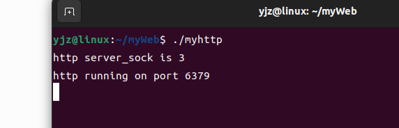

### 编译

```
make
```

生成myhttp执行文件


```
cd httpdocs
```

进入httpdocs文件夹

```
gcc get_test.c -o get.cgi
```

生成get.cgi文件

```
gcc post_test.c -o post.cgi
```

生成post.cgi文件


### 测试

```
cd ,,
./myhttp
```



```
在浏览器输入 http://localhost:6379
```


```
输入 http://localhost:6379/getcase.html
```


```
输入 http://localhost:6379/postcase.html
```


### 框架


